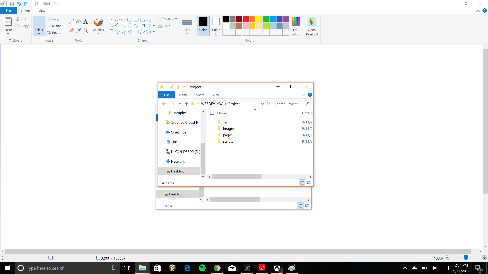

# My First README.md
## __Introduction__
---
There certainly was a lot of material to absorb this first week, but I think I'm starting to get the hang of things. I never knew there was such a community online that was specifically for creating and sharing code. It's still a lot to handle and is proving a little difficult. Some of the things I learned this week:
* GitHub
* Markdown syntax
* Atom text editor
* Directories and repos
* Proper file management

Attached is an image of my file directory, organized as instructed: 

## __Difficulties__
Besides using GitHub, another site I used for information was [Lynda.](https://www.lynda.com/) However, there are still some things I need to spend some more time on.
  1. GitHub navigation
  2. Markdown syntax and formatting
  3. Atom navigation and commands

  I currently feel very overwhelmed with all of this new information and making my way through two totally new programs with totally unique workflows.

  Here is one additional line of text.
