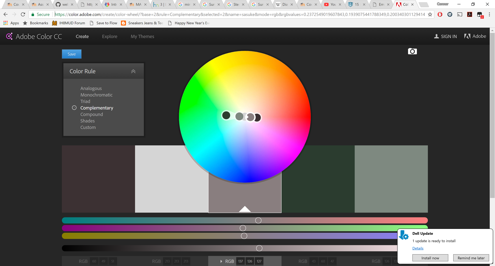

# Project 2: The Instructable
## First Impressions
The material covered for this assignment was definitely difficult, but it all built on concepts we learned last assignment which made it easier. I'm totally new to web design so it is taking me me time to get used to writing in a different format and actually embedding the formatting of the page into your "writing." I also ran into an issue with Atom that many other students have faced as well. It seems to be an easy workaround, but still a bit frustrating to have the program crash now and again while trying to work.

## Designing my page
One thing I was unaware of is the role colors and design play in coding. I suppose I had never really considered how a webpage knew to display certain colors and fonts, so that was eye-opening to learn about embedding those instructions into code. I used [Adobe Color CC](https://color.adobe.com/) to pick colors, although I didn't end up picking anything very exciting.  I ended up using a basic Times New Roman font for this project, as I wanted to spend the most time on the actual coding here and not waste time fretting over fonts. TNR tends to be a clean, simple font that still looks fairly professional. Hopefully once I become a bit more proficient at actually coding, I can spend more time finding the perfect color palette and font for my projects.

## This week's material
I spent a good amount of time with this week's lessons on the website. There were a lot of new commands to learn, and I found myself backtracking to re-read certain pages multiple times. I think this is good however, as it makes me really learn the material and not just skim over it. As I imagine most web design goes, the actual content of my page was really an afterthought as I spent most of my time making sure I was using the correct code in the correct places and minding the assignment checklist to make sure I hit all the requirements.
